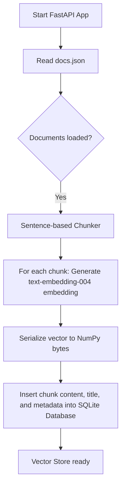
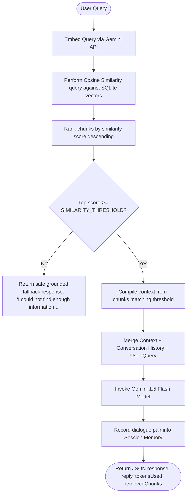
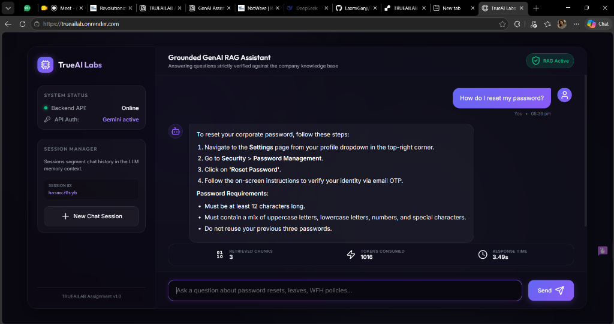
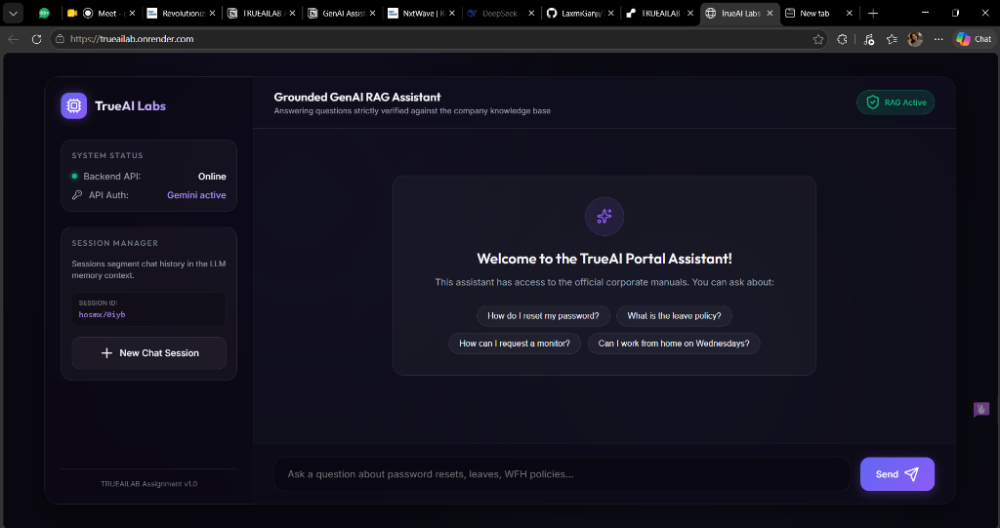

# Production-Grade GenAI Assistant with RAG

This repository contains a production-grade, self-contained **Retrieval-Augmented Generation (RAG)** Chat Assistant. The application is built with a high-performance **FastAPI** backend in Python and a premium glassmorphic **HTML/CSS/JS** frontend. It utilizes **Google Gemini** for high-quality language modeling and text embeddings.

---

## Key Features

1. **Embedding-based Search**: Employs real semantic retrieval using Gemini's 768-dimensional `text-embedding-004` model.
2. **SQLite Vector Store**: Custom, lightweight SQLite vector store using NumPy for fast Cosine Similarity computations.
3. **Strict Grounding Boundary**: Automatically filters retrieved context using a similarity threshold (`SIMILARITY_THRESHOLD`). If no matches pass the threshold, the backend immediately stops and returns a safe fallback message without calling the LLM (saving token costs and preventing hallucination).
4. **Conversational Memory**: Maintains short-term conversation memory (tracks the last 5 rounds of user/assistant dialogue) keyed by a unique `sessionId` stored in the frontend's `localStorage`.
5. **Interactive UI Dashboard**: Visually metrics-driven glassmorphism dashboard showcasing retrieved chunk counts, token consumption, query latency, server status, and session details.

---

## Directory Structure

```
assessment/
│
├── app/
│   ├── models/
│   │   └── chat.py          # Request and response validation schemas (Pydantic)
│   ├── prompts/
│   │   └── templates.py     # Grounded system and context instruction prompts
│   ├── routes/
│   │   └── chat.py          # HTTP controllers: POST /api/chat and GET /health
│   ├── services/
│   │   ├── embedding.py     # Gemini Embedding API integration
│   │   ├── llm.py           # Gemini 1.5 Flash text generation service
│   │   └── rag.py           # Ingestion, chunking, retrieval thresholding, & pipeline coordination
│   ├── utils/
│   │   ├── logger.py        # Application-wide structured logging
│   │   └── session.py       # Session-based conversational memory manager
│   ├── vectorstore/
│   │   └── simple_store.py  # SQLite database storing metadata + numpy binary embeddings
│   └── main.py              # Application entrypoint, CORS configuration, and static mounts
│
├── frontend/
│   ├── index.html           # UI layout with marked.js and lucide icons
│   ├── styles.css           # Custom glassmorphic styling, animations, and typography
│   └── app.js               # Event handlers, chat feed renderer, and storage management
│
├── docs.json                # Fictional company knowledge portal documents
├── requirements.txt         # Core dependencies
├── .env                     # Local environment variables
├── .env.example             # Example template for setting up variables
└── README.md                # Technical walkthrough and installation guide
```

---

## System Architecture & Workflow

### 1. Ingestion / Indexing Workflow (At Server Startup)


### 2. Retrieval & Query Pipeline (`POST /api/chat`)


---

## Core Technical Explanations

### 1. Embedding Strategy
* **Model**: `models/text-embedding-004` (Google Gemini API).
* **Dimensionality**: 768 dimensions.
* **Task Context**: 
  * Documents are embedded using `task_type="retrieval_document"`. This prepares content chunks to be queried against.
  * User queries are embedded using `task_type="retrieval_query"` to maximize semantic alignment.

### 2. Custom Similarity Search (Cosine Similarity)
Vectors are stored as binary buffers (`float32` byte arrays) in an SQLite table. When a query is initiated, vectors are fetched into memory, reconstructed into NumPy arrays, and evaluated against the query vector using:

$$\text{Similarity}(q, d) = \frac{q \cdot d}{\|q\| \|d\|}$$

```python
dot_product = np.dot(query_vec, doc_vec)
norm_q = np.linalg.norm(query_vec)
norm_d = np.linalg.norm(doc_vec)
similarity = dot_product / (norm_q * norm_d)
```
Scores are ranked in descending order. Only chunks satisfying the `SIMILARITY_THRESHOLD` are injected into the prompt.

### 3. Prompt Design & Grounding
The prompt is constructed to enforce strict grounding boundaries. The LLM is directed to act as an assistant utilizing **only** the provided context:
```
You are a helpful assistant.
Use ONLY the provided context to answer the question. If the context does not contain enough information to answer, reply with the exact phrase:
"I could not find enough information in the knowledge base to answer this question."

Do not use any external knowledge. Stay strictly grounded in the context provided below.

Context:
{retrieved_context}

Conversation History:
{history}

Question:
{user_question}
```
This prompt template, combined with the similarity threshold check, guarantees that the assistant will never hallucinate details outside `docs.json`.

---

## Quick Start Setup Instructions

### 1. Prerequisites
* Python 3.10 or higher.
* A Google Gemini API key. You can get one from [Google AI Studio](https://aistudio.google.com/).

### 2. Installation
Clone the repository, navigate into the project directory, and install the required dependencies:
```bash
pip install -r requirements.txt
```

### 3. Configure Environment Variables
Create a `.env` file in the root folder (or copy `.env.example`):
```bash
copy .env.example .env
```
Open `.env` and fill in your Gemini API key:
```env
PORT=8000
HOST=127.0.0.1
GEMINI_API_KEY=AIzaSy...your_gemini_key_here...
SIMILARITY_THRESHOLD=0.55
TOP_K=3
```

### 4. Run the Application
Start the FastAPI server:
```bash
uvicorn app.main:app --reload
```
The server will automatically load `docs.json`, chunk the documents, query the embedding API, and initialize the SQLite database (`vectorstore.db`).

### 5. Access the Frontend
Open your browser and navigate to:
```
http://localhost:8000/
```
You will be greeted by the premium glassmorphic interface. You can immediately click on any of the suggestion chips or ask a custom question.

---

## Testing API Endpoints

### 1. Health check (`GET /health`)
```bash
curl http://localhost:8000/health
```
**Response:**
```json
{"status": "healthy"}
```

### 2. Chat Endpoint (`POST /api/chat`)
```bash
curl -X POST http://localhost:8000/api/chat \
  -H "Content-Type: application/json" \
  -d '{"sessionId": "test123", "message": "How can I reset my password?"}'
```
**Response:**
```json
{
  "reply": "To reset your corporate password, navigate to the Settings page from your profile dropdown in the top-right corner. Go to Security > Password Management. Click on 'Reset Password' and follow the email OTP verification instructions. Passwords must be at least 12 characters long and cannot reuse your previous three passwords.",
  "tokensUsed": 242,
  "retrievedChunks": 1
}
```

### 3. Triggering Grounding Fallback
```bash
curl -X POST http://localhost:8000/api/chat \
  -H "Content-Type: application/json" \
  -d '{"sessionId": "test123", "message": "What is the capital of France?"}'
```
**Response:**
```json
{
  "reply": "I could not find enough information in the knowledge base to answer this question.",
  "tokensUsed": 0,
  "retrievedChunks": 0
}
```

---

## Live Deployment Instructions

The application is structured to be extremely easy to deploy. Since the frontend is mounted statically inside FastAPI (`app.mount("/", StaticFiles(directory="frontend", html=True))`), the entire system builds into a single self-contained application run on a single port.

### Deployment on Render (Recommended)
1. Push this codebase to a GitHub repository.
2. Log in to [Render](https://render.com/) and click **New > Web Service**.
3. Link your GitHub repository.
4. Configure the service settings:
   * **Environment**: `Python`
   * **Build Command**: `pip install -r requirements.txt`
   * **Start Command**: `uvicorn app.main:app --host 0.0.0.0 --port $PORT`
5. In the **Environment Variables** tab, add:
   * `GEMINI_API_KEY`: *(Your Google AI Studio API Key)*
   * `SIMILARITY_THRESHOLD`: `0.55`
   * `TOP_K`: `3`
6. Click **Deploy Web Service**. Render will build and host your RAG assistant!

---

## Live Application Screenshots

### 1. Active Chat & Grounded Response


### 2. Welcome Portal Dashboard


